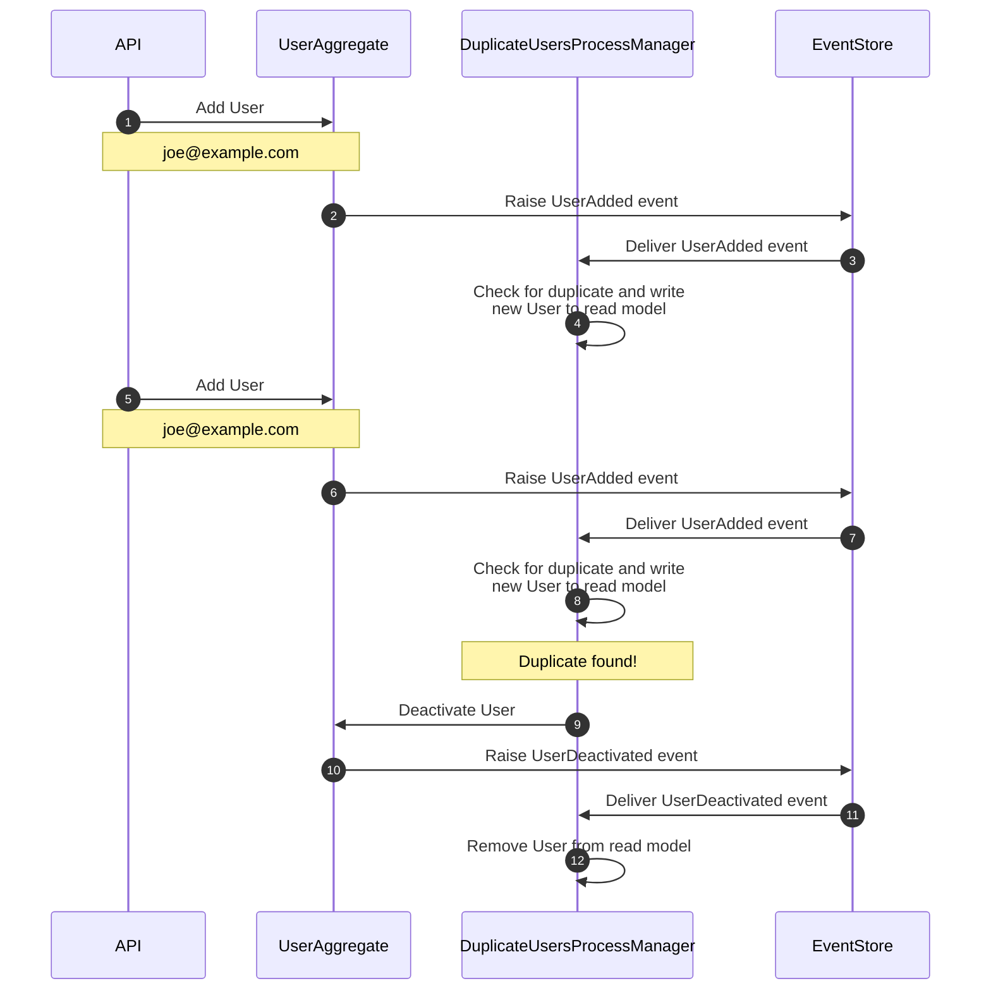

# Unique Constraints

This pattern is to deal with situations where you want to enforce a constraint across multiple consistency boundaries.

It doesn't have strong consistency, and instead relies on a corrective measure after the fact to avoid requiring a lock.

In this example, the corrective step is to deactivate the new `User`, but it could be anything from adding it to another projection to be checked, or just alerting.

Steps 1 & 5 in the diagram above indicate requests to add a new user via the API in the project.

Once each request is made, the `UserAggregate` handles the command that is dispatched, and saves a `UserAdded` event to `EventStore` (steps 2 & 6).

The `DuplicateUsersProcessManager` is listening to the `$ce-users` event stream, and handles each event sequentially (steps 3 & 7). It checks for any existing users using a read model that is owned by the process manager and writes the newly added user to the read model (steps 4 & 8).

If the email address was unique (step 4), nothing else needs to happen as the constraint hasn't been broken. If the email address was not unique (step 8), we send a command to deactivate the `User` (step 9).

The `UserAggregate` then handles this command, raising an event to deactivate the `User` (step 10).

We need to make sure we handle this deactivation event in our process manager (steps 11 & 12) as we need to remove the entry for this user in our read model.
